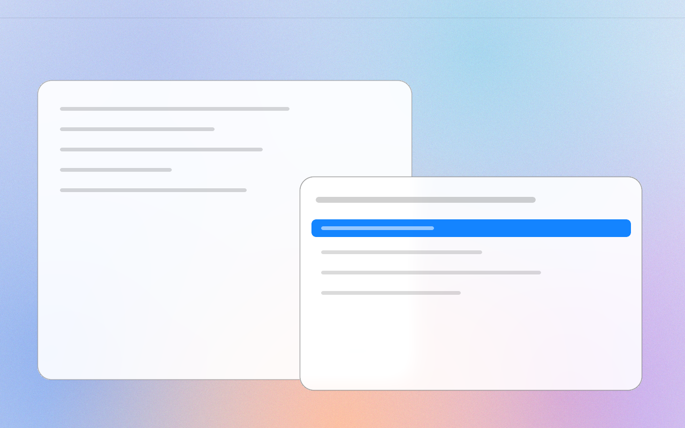

# Apple Glass Light

A macOS-inspired light theme for [Omarchy](https://omarchy.org): bright
translucent glass blur, vibrancy-tuned surfaces, and soft generated
gradient wallpapers.

Pairs with [apple-glass](https://github.com/macarchy/apple-glass)
(the two switch on a schedule via `omarchy-auto-appearance` from
[omarchy-mac](https://github.com/macarchy/omarchy-mac)) and with the
[omarchy-aquarium](https://github.com/macarchy/omarchy-aquarium) animated
background, which the glass blur is tuned against.

## Install

    omarchy-theme-install https://github.com/macarchy/apple-glass-light

## License

MIT. Wallpapers are original generated gradients.
