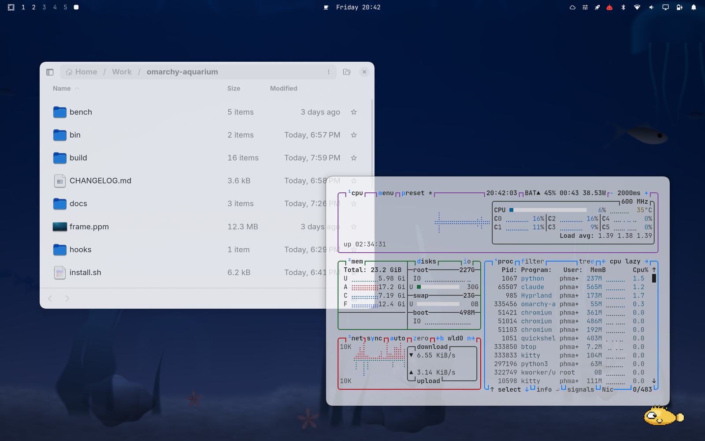
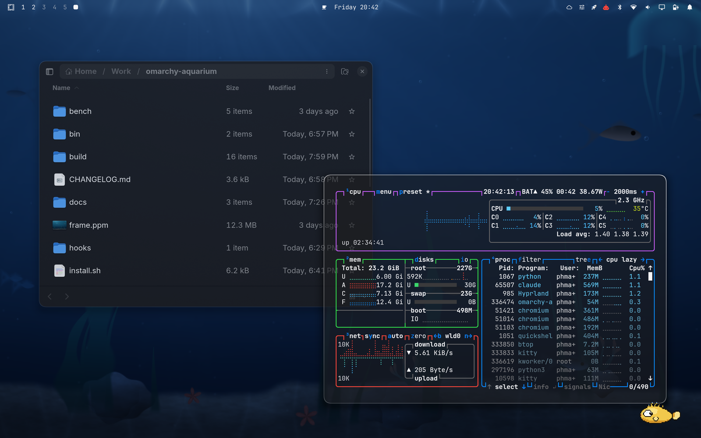

# Apple Glass Light

A macOS-inspired **light** theme for [Omarchy](https://omarchy.org). Bright
translucent glass, squircle corners, and a palette that started from Apple's
light-mode system colors and was then darkened until it actually passed contrast
**on the translucent ground it really sits on**.



The part a screenshot cannot show: **this theme was tuned against moving water.**
The blur and the palette were both set with the
[omarchy-aquarium](https://github.com/macarchy/omarchy-aquarium) animated
background running underneath: a live GLSL underwater scene, not a still
wallpaper. Light glass is the harder half of the pair: a bright pane over dark
water goes grey fast, so `brightness` has to lift the backdrop toward white
(1.16), `vibrancy` has to drop further than in the dark theme (0.14, because a
light pane that picks up the water's color reads as tinted plastic), and the
window alpha is higher throughout. The theme still works over a static
wallpaper; it was simply not tuned there.

Pairs with **[apple-glass](https://github.com/macarchy/apple-glass)**. The two
switch automatically on the sun (sunrise and sunset for your location, or a
fixed window) via `macarchy-auto-appearance` from
[macarchy-core](https://github.com/macarchy/macarchy-core), the same way macOS's
"Auto" appearance setting works. Choosing any *other* theme is treated as an
override, so the timer never yanks a deliberate choice out from under you.

## Install

```sh
omarchy-theme-install https://github.com/macarchy/apple-glass-light
```

## Palette

These are not Apple's stock light-mode colors, and that is the point. They began
as Apple's *accessible* variants (systemRed `#d70015` rather than `#ff3b30`, and
so on). But on this theme text sits on a 0.70-alpha pane over the aquarium,
whose water pulls the effective terminal ground down to roughly `#95afcf` at its
darkest daytime — measured, not guessed — and at that ground even the accessible
set fell below 3:1. Every ANSI color below is the **minimal** darkening (hue and
saturation kept) that reaches WCAG 3:1 on that measured ground. `muted` reaches
4.5:1, because it carries body text: dim lines and comments.

| Role | Hex | | Role | Hex |
| --- | --- | --- | --- | --- |
| `accent` | `#007aff` | | `red` | `#b80012` |
| `selection` | `#d1d1d6` | | `orange` | `#aa2c00` |
| `muted` | `#414144` | | `yellow` | `#864c00` |
| `background` | `#f5f5f7` | | `green` | `#1b682e` |
| `dark_background` | `#e8e8ed` | | `cyan` | `#00618d` |
| `darker_background` | `#d8d8de` | | `blue` | `#0040dd` |
| `lighter_background` | `#ffffff` | | `magenta` | `#7f3f9e` |
| `foreground` | `#1d1d1f` | | `brown` | `#6d573b` |
| `dark_foreground` | `#414144` | | `bright_red` | `#b70a00` |
| `light_foreground` | `#3a3a3c` | | `bright_yellow` | `#755507` |
| `bright_foreground` | `#000000` | | `bright_green` | `#1b682f` |
| | | | `bright_cyan` | `#106086` |
| | | | `bright_blue` | `#0058b8` |
| | | | `bright_magenta` | `#8a24bd` |

Note that the `bright_*` slots are no longer vivid. On light glass, vivid is
unreadable.

On light glass the window rim is a dark hairline rather than a highlight: the
pane is brighter than what surrounds it, so its edge reads as a shadow.

```
active   rgba(00000059) → rgba(00000018) at 135°
inactive rgba(00000014)
```

## The material

From `hyprland.lua`, applied after Omarchy's own look-and-feel so it wins while
this theme is current and is gone the moment you set another one. Nothing
outside the theme directory is touched.

| Setting | Value | Why |
| --- | --- | --- |
| `blur.size` / `blur.passes` | `20` / `4` | Matches the dark theme: the deep macOS-style frost. The 4th pass is the only real cost; size alone is free in dual-kawase. |
| `blur.brightness` | `1.16` | What makes this read as *light* glass — Apple's light material lifts the backdrop toward white before tinting it. Over deep-blue water the lift has to be stronger than it would over a bright wallpaper, or the panes turn murky. |
| `blur.contrast` | `0.95` | |
| `blur.vibrancy` | `0.14` | Lower than the dark theme. The water is already saturated; a light pane that picks up its color looks like tinted plastic. |
| `blur.vibrancy_darkness` | `0.0` | Deepening shadows here would only make the pane look dirty. |
| `blur.noise` | `0.02` | A trace of grain, also hiding banding. |
| `blur.xray` | `true` | Every pane blurs straight through to the background layer, not to the windows behind it, so stacked translucency stops compounding. |
| `blur.ignore_opacity` | `true` | Apps that paint their own translucency get the material too. |
| `rounding` / `rounding_power` | `14` / `2.6` | `rounding_power > 2` bends the corner into a squircle, the continuous curve macOS uses, instead of a circular quarter-arc. |
| `border_size` | `1` | A hairline. |
| `gaps_in` / `gaps_out` | `6` / `12` | |
| `shadow` | range `26`, power `3`, offset `0 6`, `rgba(00000026)` | Shorter and much fainter than the dark theme's — a dark-mode-strength shadow reads as grime against a bright wallpaper. |
| `misc.session_lock_blur` | `true` | Glass over the desktop while locked. |

**Window opacity.** Regular windows run `0.93` focused / `0.87` unfocused —
higher than the dark theme, because dark text on a translucent light pane loses
contrast faster than light text on a dark one: what shows through raises the
floor instead of lowering the ceiling. Terminals are the exception, carrying
their own glass (`0.70` background alpha in `alacritty.toml`, `kitty.conf` and
`foot.ini`) so glyphs stay fully opaque while the background lets light through.
The compositor leaves them at `1.0` / `0.95` and skips blurring them, which keeps
the scene behind crisp instead of frosting it into a featureless slab.

Those terminals are matched by Omarchy's own `terminal` tag
(`default/hypr/apps/terminals.lua`) rather than a hand-written class list.
Omarchy launches TUIs and its own terminal windows under dedicated app-ids, so
the tag's pattern ends in `org\.omarchy\..*|TUI\..*`, so every one of those is
covered the day it appears. A spelled-out regex is not: it misses each new TUI,
and it missed ghostty, wezterm and foot's `org.codeberg.dnkl.foot` app-id
outright. The miss shows up as one terminal rendering as an opaque slab beside
its glassy neighbours.

## Which surfaces are glass

Shell surfaces are layer-shell, not windows, so each namespace opts in
explicitly. Blurred: the bar, menu, notifications, OSD, polkit prompt,
reminders, clipboard, emoji picker, image selector, keyboard panel, network QR,
the network / disk / speed tests, the `macarchy.switcher` Cmd+Tab switcher, the
`phmatray.notification-center` and `macarchy.control-center` sidebars, and
`nwg-dock` when one is running. The background layer is deliberately *not*
blurred: it is the thing everything else blurs.

Every surface runs a higher alpha than its dark counterpart, for the same
contrast reason:

| Surface | Background alpha | (dark theme) |
| --- | --- | --- |
| Lock screen | `0.60` | `0.45` |
| Bar | `0.68` | `0.55` |
| App launcher | `0.74` | `0.62` |
| Menu | `0.76` | `0.66` |
| Notifications / popups | `0.78` | `0.68` / `0.70` |
| Tooltip / polkit | `0.82` | `0.72` |

Controls are inverted from the dark theme: fills are black at low alpha (`0.06`
normal, `0.10` hover), so a control reads as recessed into the light pane rather
than glowing on top of it. Keyboard focus stays loud — a `#007aff` ring at `0.9`
alpha, deliberately distinct from hover, because it is the only cue for where
the keyboard is pointing. The menu scrim dims toward grey (`#3a3a3c`), not
toward black, the way macOS does.

## What ships

- `colors.toml` — the contrast-corrected palette above, plus the Hyprland border
  gradients.
- `hyprland.lua` — blur, rounding, shadows, opacity rules, layer rules.
- `alacritty.toml`, `kitty.conf`, `foot.ini` — full 16-color ANSI sets and the
  matching `0.70` background alpha.
- `shell.bar.toml`, `shell.controls.toml`, `shell.launcher.toml`,
  `shell.lock.toml`, `shell.menu.toml`, `shell.notifications.toml`,
  `shell.polkit.toml`, `shell.popups.toml`, `shell.tooltip.toml`,
  `shell.image-picker.toml` — the Omarchy shell surfaces.
- `claude.json` — a matching Claude Code theme, carrying the same corrected
  colors into the terminal UI (diffs, prompt border, plan/accept modes).
- `icons.theme` — `Yaru-blue`.
- `backgrounds/` — three original generated gradients at 2560×1600:
  *Daybreak*, *Sandstone*, *Seaglass*. Use them, or run the aquarium instead.

## Gallery

The dark twin, same windows, same moment. `macarchy-auto-appearance` swaps the
two at sunrise and sunset:



[`docs/SHOTS.md`](docs/SHOTS.md) lists what is still missing, including the one
thing no still frame can carry: the water moving behind the panes.

## License

MIT. Wallpapers are original generated gradients.
